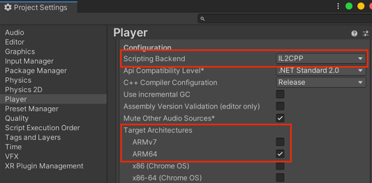
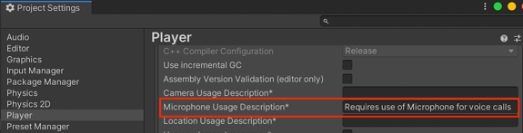

# Additional Notes

### Build on Android
To build the apk file for Android platform, you need to configure player settings below.
* Choose **IL2CPP** for **Scripting backend** in Player Settings Window.
* Set enable **ARM64** and Set disable **ARMv7** for **Target Architectures** setting in Player Settings Window.

|  | 
|------------------------------------------------------|

### Build on iOS and macOS
If building app for iOS and macOS, you need to add description for MicrophoneUsageDescription on PlayerSettings.(If not add description, build is failed.)

|  | 
|------------------------------------------------------|

