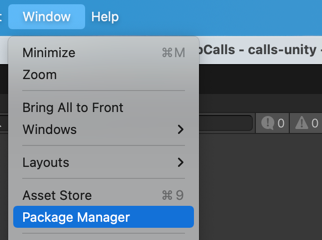
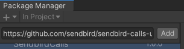

# Install Calls SDK

### Step 1: Select Window/Package Manager in the menu bar.
|  | 
|----------------------------------------|

### Step 2: Click `+` button at the top left of the window, and select `Add package from git URL...`
|  | 
|------------------------------------|

### Step 3: Input the string below to the input field.
`https://github.com/sendbird/sendbird-calls-unity.git`

|  | 
|------------------------------------------|

### Step 4:  Click `Add` button, and will start install the package. 
